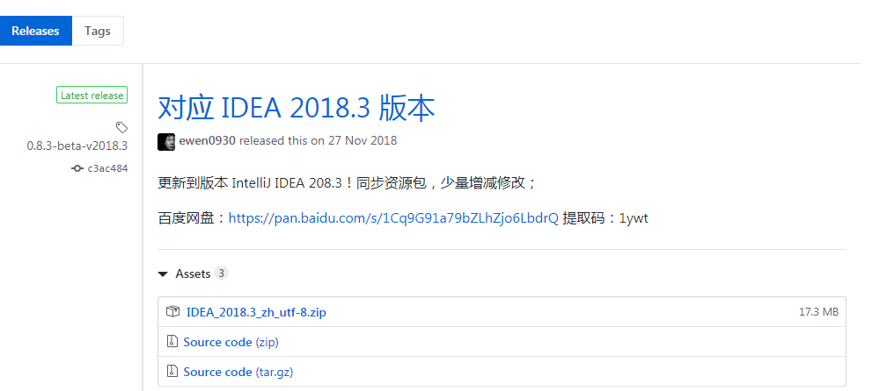
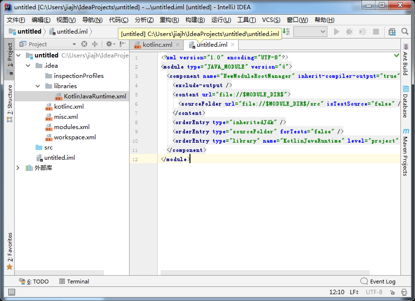
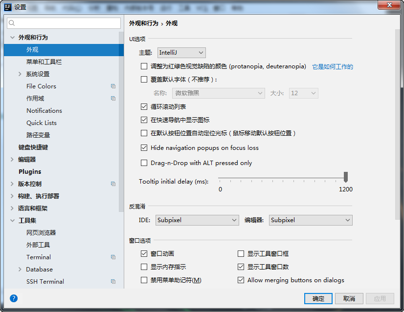

## IntelliJ IDEA Chinese Language Pack（中文语言包）

按图上点击进入Releases, 下载IDEA_2018.3_zh_utf-8.zip

把压缩包解压到Intellij IDEA安装路径并覆盖,里面的"lib/resources_zh.jar"会拷贝到IDEA安装目录下的lib目录.
中文环境重启即可！当然为见效可以参考一下环境.
其他语言环境需要添加配置文件
(见) 
Mac:

/Applications/IntelliJ IDEA CE.app/Contents/bin/idea.vmoptions 增加 
                                                 ↑  这里根据环境不同 可以是idea64.vmoptions
-Duser.language=zh
-Duser.region=CN
 
Windows:
打开IDEA的安装目录下的bin/idea.exe.vmoptions，在文件中添加下面两行：
                          ↑  这里根据环境不同 可以是idea64.exe.vmoptions
-Duser.language=zh
-Duser.region=CN

主要是扫描PhpStorm的翻译，做的这个中文语言包，汉化程度有限……

----------

同系列IDE：

[PhpStorm 中文语言包](https://github.com/ewen0930/PhpStorm-Chinese) 

[WebStorm 中文语言包](https://github.com/ewen0930/WebStorm-Chinese) 

[PyCharm 中文语言包](https://github.com/ewen0930/PyCharm-Chinese)

另外由 @pingfangx 汉化的 Android Studio 在[这里](https://github.com/pingfangx/TranslatorX/releases)
